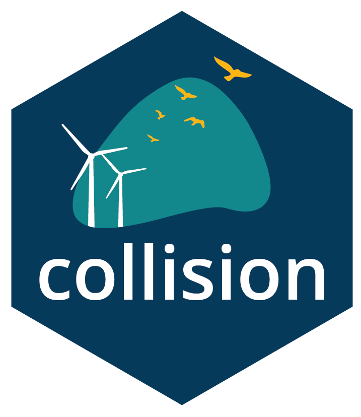

<!-- README.md is generated from README.Rmd. Please edit that file -->

# collision

collision


<!-- badges: start -->
<!-- badges: end -->

## Installation

You can install the development version of collision from
[GitHub](https://github.com/) with:

``` r
# install.packages("remotes")
devtools::install_github("SymbolixAU/collision")
```

## Note on status

This package is under active development towards v1.0 milestone

## About

This package was developed by contribution of code and maths from
[Symbolix](www.symbolix.com.au) and [Biosis](www.biosis.com.au), and
also draws from open source code (TODO ADD IN REFS). It is made
available under a GPL-3 licence.

The number of collisions per year is calculated as:

$N_{C}= N_{I} \times P(C|I) \times (1 - \alpha)$, where $N_{I}$ is the
number of interactions with turbines, $P(C|I)$ is the probability of
collision given interaction, and $\alpha$ is the probability of turbine
(meso + macro) avoidance, i.e. birds modifying their flight patterns in
the presence of turbines, to go around, above, below or to dynamically
avoid the sweeping blade.

$N_{I}$ is calculated based on activity rate (flights per year per km^2)
and the area occupied by turbines. $P(C|I)$ is calculated properties of
the turbine and the archetype bird species and $\alpha$ is generated
from literature review.

This package offers an R package for using and comparing different
approaches to stochastic modelling of collision rates between birds and
turbines.

It estimates:

- Site activity rate from distance corrected data
- Number of interactions per year with turbines (this can be extended to
  include spatial probability), i.e. number of flights per year through
  the rotor swept area
- Probability of collision with turbine blades for interacting flights.
  This uses Band 2009 stage 2 calculation or the Biosis CRM.

## History and provenance

Collision risk models (CRMs) predict the long-term average annual
collision rate between birds and wind turbines. The onshore wind energy
industry in Australia developed specific, data collection and CRM to
account for how birds make use of terrestrial habitats. This package is
an evolution that cpatures the strengths of the Australian approach,
while integrating the key developments (e.g. stochastic inputs) from
Europe and the UK.

A brief history of Australian CRM is below:

- 2000;2009: Band \[UK\] (Open source) [TODO LINK]()
  - $P(C|I)$ worksheet
  - simple methods for $n$ and $P(I)$ (which are largely superceded)
  - Calculation of one value for whole site
- \~2004:
  [Biosis](https://wildlife.onlinelibrary.wiley.com/doi/10.1002/wsb.257)
  - Developed in and for Australia - accounts for resident species
  - \*\* $n$ from field counts\*\*
  - \*\* $P(I)$ from geometric calc\*\*
  - Slightly amended P(C\|I) allows for flights through at any
    direction, not just up or downwind
- 2008: Nature Advisory (+ Symbolix) \[Aus\]
  - $n$ from distance corrected field counts
  - \*\* $P(I)$ from flight paths or scenario \*\*
    - Spatial, per turbine calc
  - $P(C|I)$ from Band 2009
- 2012: Band updated guidance
  - Added flight ‘flux’ calculation -from bird speed and field counts
    - Sensitive to bird flight speed estimate (Madsen & Cook 2015)
- 2015: Madsen & Cook \[UK\] (Open source)
  - **Stochastic (simulation) allows uncertainty in inputs**
  - Based on Band 2012/2009
  - Whole site only
- 2024: `collision` (this package)
  - $n$ from distance corrected field counts
  - $P(I)$ from flight paths or scenario
    - Spatial, per turbine calc
  - $P(C|I)$ from Band 2009
  - **Stochastic**
